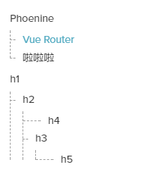
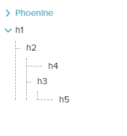
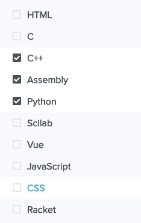
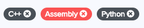

# PhUI

> 一部分借鉴了 ElementUI 的组件。

## button

目前只用于图标圆形按钮，自带active css。

## card

可用组件：

- ph-card

除了普通的 `header slot` 以及作为 `defualt slot` 的 `body` 之外，还有 `media slot` 能自动绑定 `children` 中 `a` 元素的链接。

### ph-card

选项：

- header： 标题字符串
- headerStyle： 标题样式
- bodyStyle: body样式
- plain： 移除header以及body默认的样式
- router： 决定media部分点击时是直接改变`window.location`还是通过`$router.push`

## catalogue

可用组件：

- ph-catalogue
- ph-catalogue-item

`ph-catalogue-item` 代表每一个目录标题，`ph-catalogue` 负责组织所有 `ph-catalogue-item` 子元素生成目录（通过堆栈，以及树结构）。

	<ph-catalogue>
	  <ph-catalogue-item level="1" title="h1" />
	  <ph-catalogue-item level="2" title="h2" />
	  <ph-catalogue-item level="4" title="h4" />
	  <ph-catalogue-item level="3" title="h3" />
	  <ph-catalogue-item level="5" title="h5" />
	</ph-catalogue>

**示例：**

可关闭的：

### ph-catalogue

选项：

- indent： 目录的缩进，单位为`px`，默认`18`
- defaultTitle： 当不是已一级标题开头时会以此作为标题
- closable： 目录是否可关闭

### ph-catalogue-item

选项：

- level： 目录标题的级别，从1开始，1最高；默认为1
- title： 目录标题字符串
- id： 标题相应的锚，默认为""

## checkbox

可用组件：

- ph-checkbox
- ph-checkbox-group

`checkbox` 的选取状态暂且由 fontawesome 的 icon 表示，以待更改。

### ph-checkbox

可有 `v-model` 绑定值

    label: {},
    name: String,
    checked: Boolean,
    trueLabel: [String, Number],
    falseLabel: [String, Number],
    labelStyle: Object,
    textColor: String,
    activeBgColor: String,

### ph-checkbox-group

可直接代理所有 `ph-checkbox` 子组件的值

	<ph-checkbox-group v-model="[]">
	  <ph-checkbox label="1" />
	  <ph-checkbox label="2" />
	  <ph-checkbox label="3" />
	</ph-checkbox-group>

## collapse

可用组件：

- ph-collapse
- ph-collapse-item

### ph-collapse-item

提供collapse效果的组件。

	<ph-collapse-item title="collapse">
	  1
	  2
	  3
	</ph-collapse-item>

选项：

- title： 标题
- name： 这个选项在母组件为 `ph-collapse` 时，会用于判断自己是否在母组件的 `model` 中，从而决定是否被激活。

每个 `ph-collapse-item` 在作为 `ph-collapse` 的子组件时，都会被赋值一个 `index` 。因此在没有赋值 name 的情况下 `ph-collapse` 也能记录哪个 `ph-collapse-item` 被激活了。但如果需要通过跨元素绑定同一个值，即两个 `ph-collapse` 绑定同一个值的时候，则应该赋予每个 `ph-collapse-item` 独有的 `name`，详情见 `ph-collapse`。

### ph-collapse

通过 v-model 绑定值，绑定值得类型可为：

- String
- Array
- Number

选项：

- accordion： `Boolean`；决定是否为风琴模式。 `accordion` 为真时，所有子元素中同一时间激活一个，其他激活的都会自动关闭。

当子组件 `ph-collapse-item` 被激活时，`ph-collapse` 绑定值会被更新。

当绑定值类型为 `String` / `Number` 时，则会也与风琴模式有同样的效果。

当绑定值类型为 `Array` 时则能记录多个被激活的值。

每个子组件 `ph-collapse-item` 都会被赋予 `index` ，从`0`开始。因此当两个 `ph-collapse` 绑定同一个值时，则两者的子组件的 index 会有重复。这样在没有给子组件赋值 `name` 属性的情况下就无法准确判断哪个 `ph-collapse-item` 被激活。

## icon

可用组件：

- ph-arrow-icon
- ph-menu-icon

### ph-arrow-icon

选项：

- initStatus： 代表未激活时 `arrow` 的指向，可选[top, down, left, right]
- activeStatus: 代表激活时 `arrow` 的指向，可选[top, down, left, right]
- active: `Boolean`，代表 `icon` 有没有被激活
- color: `arrow` 颜色

可触发的事件：

- click

### ph-menu-icon

可由 `v-model` 绑定激活的值。

## navbar

可用组件：

- ph-nav
- ph-nav-list
- ph-nav-item

### ph-nav

提供 `.ph-navbar-brand` 类用于 brand

主要作为容器

### ph-nav-list

选项：

- align： 在 `ph-nav` 中的对齐方式，可选 [`left`, `right`， `center`]
- type： 类型，可选 [`plain`, `card`]
- hiddenUp： 决定在哪个 `size` 以上隐藏，可选[`lg`, `md`, `sm`, `xs`]
- hiddenDown： 决定在哪个 `size` 以下隐藏，可选[`lg`, `md`, `sm`, `xs`]

size:

- lg： `1200px`
- md： `992px`
- sm： `768px`
- xs： `576px`

### ph-nav-item

选项：

- hiddenUp： 决定在哪个 `size` 以上隐藏，可选[`lg`, `md`, `sm`, `xs`]
- hiddenDown： 决定在哪个 `size` 以下隐藏，可选[`lg`, `md`, `sm`, `xs`]

## sidebar

> 侧边栏

可用组件：

- ph-sidebar
- ph-sidebar-list
- ph-sidebar-item
- ph-sidebar-divider

### ph-sidebar

可由 `v-model` 绑定一个确定是否打开 `sidebar`。

选项：

- closable： 决定是否可关闭
- cover： 决定是否在被打开时显示遮层
- attach： 决定是否为依附模式
- zBaseIndex： 用于确定组件内关键组件的 `z-index`

提供

	<slot name="icon"></slot>

插槽用于自定义与 `ph-sidebar` 绑定的菜单激活按钮。

关于 `z-index`，在 `ph-sidebar` 中的元素中被绑定的顺序从小到大为：

1. 遮层
2. 默认的菜单按钮/attack模式下的菜单按钮
3. 侧边栏

**注：在自定义菜单按钮的情况下，第二项不会被赋予 `z-index`。**

可触发的事件：

- item-click： click on ph-sidebar-item
- aside-click: click on aside in ph-sidebar

### ph-sidebar-list

没有功能，目前的功能是作为一个 `wrapper`。

### ph-sidebar-item

该组件被 `click` 之后，如果 `ph-sidebar` 是 `closable` ，则会使 `ph-sidebar` 直接关闭。

可触发的事件：

- click

### ph-sidebar-divider

just a simple divider

## tabs

可用组件：

- ph-tabs
- ph-tab-pane

### ph-tabs

可由 v-model 绑定值

选项：

- activeName： 表示一开始激活的 pane 名字

可触发的事件：

- tab-click
- input

### ph-tab-pane

选项：

- label： 该 `pane` 显示的名称
- name： 该 `pane` 被识别的值

另外，`ph-tab-pane` 也支持 `label` 插槽。

## tag

可用组件：

- ph-tag

### ph-tag

选项：

- content： 标签内容
- closable： 能否关闭
- plain： 是否有背景颜色
- round： 是否为圆角

可触发的事件：

- close： 在 `closable` 为真时，`click` 之后触发
- click